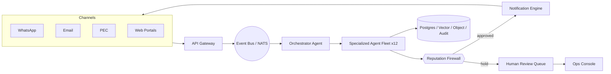

# 00 — Executive Architecture Document

**Product:** CondominioOS — Agentic Managed Service for small Italian condominiums.
**Audience:** Founders, investors, engineering leadership, compliance/legal, design partners.
**Status:** v1.0 — MVP architecture baseline.

---

## 1. Problem & opportunity

Italy has ~1.2M condominiums; the long tail of small buildings (4–30 units) is structurally
**underserved**: professional administration is expensive relative to the budget, while self-managed
buildings (_condominio minimo_, <9 owners, where an administrator is not legally mandatory) suffer
from missed payments, lapsed insurance, disorganized documents, and conflict.

The work is **high-volume, low-complexity, and highly repetitive** — an ideal fit for a governed
agentic system. CondominioOS targets a **70–85% reduction in cost-to-serve** versus a traditional
_studio di amministrazione_, by automating the operational core and keeping a licensed human
administrator supervising a large portfolio.

## 2. Product thesis

> A small condominium is a **state machine of obligations** — payments due, documents to keep,
> deadlines to meet, communications to send, decisions to ratify in assembly. CondominioOS models
> those obligations explicitly and assigns each to a specialized agent, gated by a Reputation
> Firewall and a human supervisor.

## 3. The single most important constraint: reputation

This is a **trust business**. One hallucinated legal claim, one wrong payment reminder to the wrong
resident, one GDPR leak, or one tone-deaf message can destroy the brand for an entire region (word
of mouth is the primary growth channel in this market).

Therefore the **Reputation Firewall** (doc 07) is the architectural keystone, not an add-on:
**no outbound communication, financial action, or legal statement leaves the platform without
passing through it.** Every other design decision is subordinate to this.

## 4. Architecture at a glance

- **Channels** normalize inbound messages into domain events.
- **Orchestrator** classifies intent and routes to a specialized agent.
- **Agents** plan and call governed tools; they never send anything directly.
- **Reputation Firewall** validates every outbound artifact (8 guard layers) and either approves,
  auto-revises, or routes to **human review**.
- **Notification Engine** is the *only* component allowed to emit to channels.
- Everything is recorded in an **append-only, hash-chained audit log**.

## 5. The agent fleet (13 agents)

| Agent | One-line mandate |
|---|---|
| Orchestrator | Intent classification, task routing, SLA & budget control. |
| Resident Concierge | Front door for residents (WhatsApp/email/web Q&A). |
| Maintenance | Ticket intake → triage → vendor dispatch → SLA tracking. |
| Accounting | Invoice OCR, classification, ledger posting, payment matching. |
| Collections | Arrears detection and graduated, compliant payment reminders. |
| Vendor | Vendor sourcing, quotes, scheduling, compliance (DURC, insurance). |
| Assembly | Meeting prep, agenda, convocations, proxies, minutes. |
| Compliance | Deadline & expiry monitoring, missing-document detection. |
| Document | Ingestion, OCR, classification, redaction, retrieval indexing. |
| Knowledge | RAG over per-condo + legal corpus; the factual backbone. |
| Risk | Cross-cutting scoring of legal/financial/reputational exposure. |
| QA | Evaluates agent outputs against rubrics; gates releases. |
| Human Escalation | Packages context, routes to the right human, tracks resolution. |

Full specs (responsibilities, tools, memory, I/O, failure modes, escalation, KPIs) in **doc 04**.

## 6. Operating model in one paragraph

A small number of **licensed human administrators** (the legal _amministratore_ of record) each
supervise a **large portfolio** (target: 1 administrator : 150–400 buildings) through the **Ops
Console**. Agents do the work; humans approve the risky 10% surfaced by the Reputation Firewall and
Risk Agent, and act as the legal/accountable principal. A small **operations pod** handles
exceptions, vendor relations, and customer success.

## 7. Trust & safety posture

- **Confidence-gated autonomy:** each action has an autonomy tier (A0–A3) derived from risk class ×
  confidence. Low-risk/high-confidence is fully automated; high-risk is always human-approved.
- **Audit-by-design:** hash-chained, tamper-evident event log; every agent decision is reproducible
  (prompt, model, version, inputs, tools, output).
- **GDPR by default:** EU-only data residency, data minimization, DSAR/erasure tooling, DPA-ready.
- **Legal guardrails:** the system never gives legal advice; it cites regulation and routes
  interpretation to the human administrator.

## 8. Non-functional targets (MVP → GA)

| Dimension | MVP target | GA target |
|---|---|---|
| Buildings per human admin | 50 | 150–400 |
| % actions fully automated (A3) | 60% | 90%+ |
| Outbound-message error rate | <1% | <0.1% |
| Resident question median resolution | < 5 min | < 60 s |
| p95 API latency | < 800 ms | < 300 ms |
| Availability | 99.5% | 99.9% |
| Data residency | EU (Frankfurt/Milan) | EU |

## 9. Key risks & mitigations (executive view)

| Risk | Mitigation |
|---|---|
| LLM hallucination in legal/financial context | Reputation Firewall grounding + citation checks; A-tier gating; no-legal-advice policy. |
| Sending to wrong recipient / GDPR leak | Recipient/PII guard in firewall; per-tenant isolation; redaction agent. |
| Wrong payment reminder (over-collection) | Ledger reconciliation gate before any Collections message; financial guard. |
| Regulatory non-compliance (assembly quorums, deadlines) | Compliance rules engine encoding CC articles; Assembly Agent validators. |
| Vendor liability (unlicensed/uninsured) | Vendor compliance checks (DURC, RC insurance) before dispatch. |
| Model/provider outage | LLM router with multi-model failover + degraded "human-only" mode. |
| Reputation contagion from a single error | Firewall + staged autonomy rollout per tenant + continuous QA evals. |

## 10. What "production-ready" means here

The codebase in this repo is a **runnable skeleton**: services boot, contracts compile, schemas
migrate, the LangGraph orchestration graph executes with stubbed tools, and the Reputation Firewall
is wired as a hard gate. It is engineered to be **filled in feature-by-feature** following the sprint
plan in docs 08 and 16 — not a throwaway prototype.

See doc 09 for the full technical architecture and doc 16 for the implementation plan.
