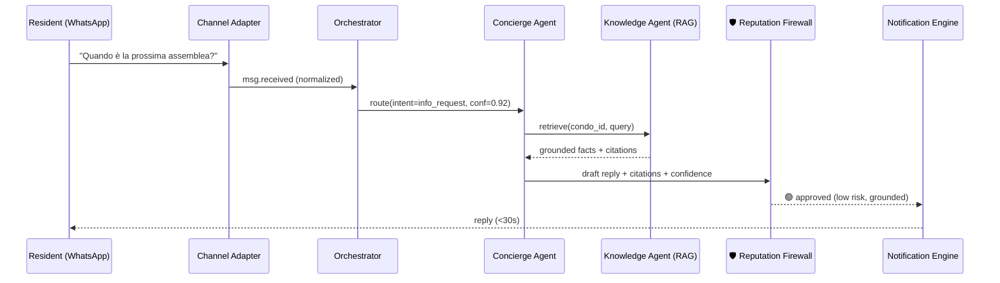
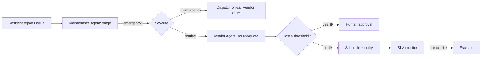
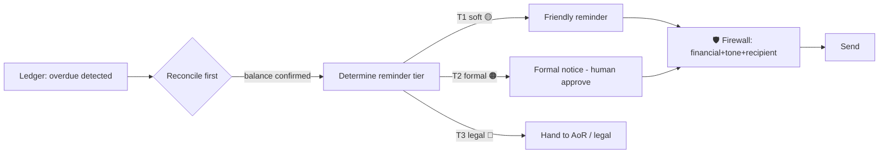

# 02 — End-to-End Service Blueprint

Maps each MVP service journey across **channel → frontstage (agent) → backstage (tools/data) →
governance (firewall/human)**. Notation per journey: **Trigger → Steps → Outputs → Gates → KPIs**.

Legend: 🟢 A3 auto · 🟡 A2 auto+notify · 🟠 A1 propose/approve · 🔴 A0 human-led · 🛡️ Reputation Firewall.

---

## J1 — Resident communication & support

- **Gates:** grounding check, PII/recipient check, tone check.
- **Escalation:** ungrounded answer, legal interpretation, complaint sentiment → 🔴 Human Escalation.
- **KPIs:** resolution rate w/o human, median latency, CSAT, hallucination rate (target 0).

## J2 — Document management

**Trigger:** document arrives (upload, email attachment, scan).
**Steps:** 🟢 ingest → OCR → classify (regolamento/verbale/polizza/contratto/fattura) → extract metadata
→ PII detect & tag → 🟢 index into per-condo vector namespace → link to entities.
**Outputs:** `document.ingested`, searchable artifact, compliance hooks (e.g., polizza → expiry).
**Gates:** 🛡️ classification confidence; low-confidence class → 🟠 human label.
**KPIs:** classification accuracy, OCR quality, time-to-searchable, % auto-classified.

## J3 — Maintenance (ticket → dispatch → SLA)

- **Triage:** severity, category, safety, budget impact, building-fund coverage.
- **Gates:** 🛡️ cost threshold, vendor compliance (DURC/insurance), resident-comms tone.
- **KPIs:** time-to-triage, time-to-dispatch (emergency), SLA adherence, reopen rate, cost/ticket.

## J4 — Accounting (invoice → ledger → payment)

**Trigger:** invoice received (email/PEC/upload).
**Steps:** 🟢 OCR → extract (supplier, P.IVA, amount, VAT, due date, line items) → validate (duplicate,
P.IVA checksum, math) → 🟡 classify to chart-of-accounts & cost center → post to ledger →
match payments (bank feed/MT940/CBI) → reconcile.
**Gates:** 🛡️ duplicate detection, amount anomaly vs history, supplier allowlist; anomalies → 🟠.
**KPIs:** straight-through-processing %, extraction accuracy, duplicate-catch rate, reconciliation lag.

## J5 — Collections (arrears → graduated reminders)

- **Hard rule:** **no reminder without ledger reconciliation** (prevents over-collection — top
  reputational risk).
- **Gates:** 🛡️ exact balance match, correct recipient (owner vs tenant — _spese_ split), tone,
  cooling-off between reminders, legal-threat language ban below T3.
- **KPIs:** days-sales-outstanding, recovery rate, complaint rate per reminder, wrong-recipient rate (→0).

## J6 — Assemblies (prep → convocation → proxies → minutes)

**Trigger:** scheduled (annual ordinary) or requested (extraordinary, ≥1/6 millesimi).
**Steps:** 🔴 AoR sets date → 🟠 Assembly Agent drafts agenda (from open items, budget, deadlines) →
🟠 generate convocation (legal content: date/time/place, agenda, ≥5 days notice) → distribute →
collect RSVPs & proxies (deleghe; respect per-proxy limits) → compute quorum (1st/2nd call) →
during meeting: capture decisions → 🟠 draft minutes (verbale) with votes & millesimi tallies →
🔴 AoR reviews & signs → distribute → spawn follow-up tasks.
**Gates:** 🛡️ legal completeness of convocation, quorum math, proxy limits, minutes accuracy vs recording.
**KPIs:** convocation compliance %, quorum-reached rate, minutes turnaround, decision-to-task conversion.

## J7 — Compliance (monitoring & detection)

**Trigger:** continuous (scheduler) + on document events.
**Steps:** 🟢 monitor expiries (insurance, contracts, fire/elevator certs, antincendio) → detect
missing mandatory docs → compute upcoming legal deadlines (assembly, rendiconto, etc.) → raise
alerts with lead time → 🟡 open remediation tasks (e.g., renew polizza → Vendor Agent).
**Gates:** 🛡️ alert accuracy (no false "all clear").
**KPIs:** zero lapsed-insurance incidents, deadline-hit rate, missing-doc detection recall.

---

## Cross-journey backstage

| Backstage capability | Used by |
|---|---|
| Knowledge/RAG (per-condo + legal corpus) | J1, J6, J7, all Q&A |
| Reputation Firewall 🛡️ | every outbound (J1, J3, J5, J6) |
| Audit log | all journeys (by design) |
| Human review queue | J1, J3, J5, J6 escalations |
| Risk scoring | J3, J5, J6 (financial/legal exposure) |

## Moments of truth (where trust is won or lost)

1. **First reminder a resident receives** — must be correct, kind, and provably owed.
2. **First assembly minutes** — must be legally complete and accurate.
3. **An emergency at 2 a.m.** — must dispatch fast and communicate clearly.
4. **A GDPR/data request** — must be handled flawlessly and quickly.

These four are the highest-priority eval suites (doc 07 §9, doc 16).
