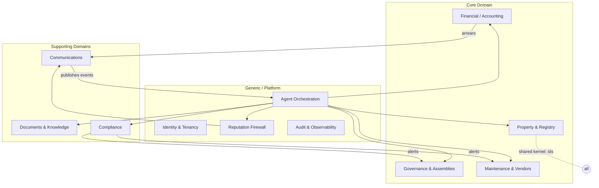

# 03 — Domain Architecture

Domain-Driven Design view: bounded contexts, aggregates, ubiquitous language (IT/EN), and context
mapping. This is the conceptual backbone that the microservices (doc 09) and data model (doc 05)
implement.

---

## 1. Ubiquitous language (IT ⇄ EN)

| Italian | English | Definition |
|---|---|---|
| Condominio | Condominium | The building/community; the tenant root aggregate. |
| Unità immobiliare | Unit | An apartment/shop/garage; ownership target. |
| Millesimi | Thousandths | Ownership/expense share (Σ = 1000) per unit per table. |
| Proprietario | Owner | Legal owner of a unit (liable for extraordinary expenses). |
| Conduttore / Inquilino | Tenant/Resident | Occupant (liable for ordinary running costs). |
| Amministratore | Administrator (AoR) | Legal principal (Art. 1129 CC). |
| Assemblea | Assembly | The decision-making meeting of owners. |
| Convocazione | Convocation | Legal notice convening an assembly (≥5 days). |
| Delega | Proxy | Written authorization to vote for another owner. |
| Verbale | Minutes | Official record of an assembly. |
| Rendiconto | Statement of accounts | Annual financial report. |
| Tabella millesimale | Millesimi table | Mapping units → shares (general, heating, lift, …). |
| Quota / Spesa | Charge | An amount owed by a unit. |
| Morosità | Arrears | Overdue charges. |
| Polizza | Insurance policy | Building insurance. |
| Regolamento | Regulations | Condominium rules. |

## 2. Bounded contexts (the map)

## 3. Bounded contexts in detail

### 3.1 Property & Registry (Core)
- **Aggregates:** `Condominium` (root), `Unit`, `Owner`, `Resident`, `MillesimiTable`.
- **Invariants:** Σ millesimi per table = 1000; a unit has exactly one current owner; residents map to units.
- **Owns:** the canonical tenant identity (every other context references `condominium_id`).

### 3.2 Financial / Accounting (Core)
- **Aggregates:** `Ledger`, `Invoice`, `Charge` (quota), `Payment`, `Budget` (preventivo), `Statement` (rendiconto).
- **Invariants:** double-entry balance; a charge is allocated by millesimi; a payment matches charges before reducing arrears.
- **Key service:** reconciliation (gates Collections).

### 3.3 Maintenance & Vendors (Core)
- **Aggregates:** `Ticket`, `WorkOrder`, `Vendor`, `Quote`, `SLA`.
- **Invariants:** a dispatched work order has a compliant vendor; emergencies bypass quote step with budget cap.

### 3.4 Governance & Assemblies (Core)
- **Aggregates:** `Assembly`, `Agenda`, `Convocation`, `Proxy`, `Resolution`, `Minutes`.
- **Invariants:** convocation notice ≥ legal minimum; quorum rules (1st/2nd call) by millesimi+headcount; proxy limits.

### 3.5 Communications (Supporting)
- **Aggregates:** `Conversation`, `Message`, `Channel`, `OutboundDraft`.
- **Invariants:** every outbound passes the Firewall; channel identity verified; consent respected.

### 3.6 Documents & Knowledge (Supporting)
- **Aggregates:** `Document`, `DocumentVersion`, `KnowledgeChunk`.
- **Invariants:** PII tagged; per-tenant vector namespace isolation; immutable versions.

### 3.7 Compliance (Supporting)
- **Aggregates:** `Obligation`, `Deadline`, `ComplianceAlert`.
- **Invariants:** every mandatory obligation has a monitor; alerts carry lead time.

### 3.8 Platform / Generic
- **Identity & Tenancy:** tenants, users, roles, channel identities.
- **Agent Orchestration:** agent runs, tasks, tool calls, memory.
- **Reputation Firewall:** guard pipeline, review queue, approvals.
- **Audit & Observability:** hash-chained `AuditEvent`, traces, metrics.

## 4. Context mapping patterns

| Upstream → Downstream | Pattern |
|---|---|
| Property → all | **Shared Kernel** (canonical ids: condominium_id, unit_id). |
| Financial → Communications | **Customer/Supplier** (arrears trigger reminders). |
| Agent Orchestration → all core | **Open Host Service** (tool APIs) + **Published Language** (events). |
| Reputation Firewall ⇄ Communications | **Conformist** (Comms must obey Firewall verdict). |
| Compliance → Governance/Maintenance | **Published Language** (alerts as events). |
| External (WhatsApp/PEC/Bank) → Channels | **Anti-Corruption Layer** (adapters normalize). |

## 5. Aggregate consistency boundaries

- **Strong consistency** within an aggregate (e.g., a payment matched against charges atomically).
- **Eventual consistency** across contexts via domain events (e.g., `payment.recorded` →
  Collections cancels pending reminder).
- **Sagas** for multi-context workflows (assembly lifecycle, dispatch lifecycle) run on the durable
  workflow engine (Temporal), not in agents.

## 6. Why this matters for the agents

Each specialized agent is **scoped to one (or two adjacent) bounded contexts** and may only call the
**Open Host Service** tools of those contexts. This keeps blast radius small, makes authorization
tractable, and lets QA/Risk reason per-context. The Orchestrator is the only agent that spans
contexts (for routing, not execution).
