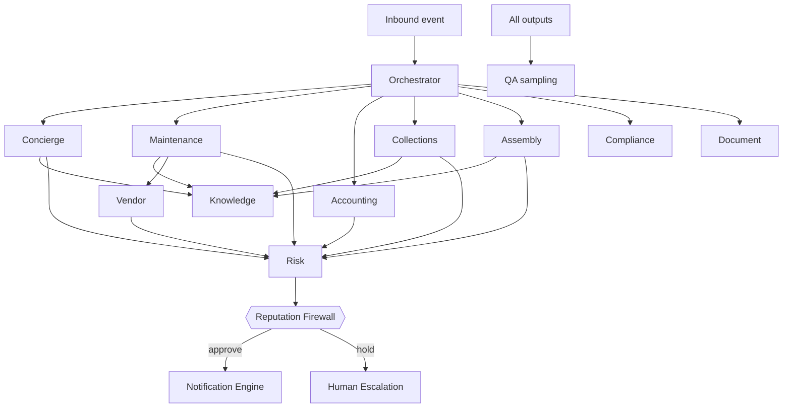

# 04 — Agent Architecture

The 13-agent fleet. Each spec follows a fixed template:
**Mandate · Bounded context · Responsibilities · Tools · Memory model · Inputs · Outputs ·
Failure modes · Escalation criteria · KPIs · Autonomy default.**

> **Implementation note:** all agents share the `BaseAgent` contract (LangGraph node) defined in
> `services/condominioos/agents/base.py`. Tools are governed (every call audited, scoped to the
> agent's bounded context, rate/budget limited). No agent may emit to a channel — only the
> Notification Engine can, and only after the Reputation Firewall approves.

---

## 0. Memory model (shared taxonomy)

| Layer | Scope | Store | Lifetime |
|---|---|---|---|
| **Working memory** | single agent run | in-process state | run |
| **Episodic** | conversation/case thread | Postgres `agent_run`, `conversation` | per case |
| **Semantic (RAG)** | per-condo + legal corpus | Qdrant namespace `tenant:{id}` | persistent |
| **Procedural** | playbooks/policies | Prompt registry + policy store | versioned |
| **Shared blackboard** | cross-agent on a task | `task` aggregate + event bus | per task |

Every agent declares which layers it reads/writes. **No agent reads another tenant's memory** (hard
namespace isolation).

---

## 1. Orchestrator Agent

- **Mandate:** Front controller. Classify intent, decompose into tasks, route to specialists, manage
  SLAs, budgets, and concurrency. Owns the task lifecycle, not domain execution.
- **Bounded context:** Agent Orchestration (spans all, executes none).
- **Responsibilities:** intent classification; task creation/decomposition; agent selection;
  priority & SLA assignment; budget/token guardrails; deadlock/loop detection; result aggregation.
- **Tools:** `classify_intent`, `create_task`, `route_to_agent`, `get_sla_policy`, `aggregate_results`,
  `check_budget`.
- **Memory:** episodic (task graph), procedural (routing policy). No semantic.
- **Inputs:** normalized inbound events (`message.received`, `document.ingested`, schedule ticks,
  `compliance.alert`).
- **Outputs:** `task.created`, `task.routed`, `task.completed`; routing decisions (audited).
- **Failure modes:** misclassification → wrong agent; infinite re-route loop; budget exhaustion.
- **Escalation:** unknown/low-confidence intent (<0.6); conflicting tasks; repeated agent failure → Human Escalation.
- **KPIs:** routing accuracy, avg hops/task, SLA adherence, budget per task, loop incidents (→0).
- **Autonomy default:** A3 (routing is internal; downstream actions carry their own tier).

## 2. Resident Concierge Agent

- **Mandate:** The resident-facing front door (WhatsApp/email/web). Answer questions, capture
  requests, set expectations — warmly and accurately.
- **Bounded context:** Communications (+ read Knowledge, Property, Financial-summary).
- **Responsibilities:** understand resident intent; retrieve grounded answers via Knowledge Agent;
  capture maintenance reports / payment questions / doc requests; manage conversation state &
  multilingual tone (IT default).
- **Tools:** `knowledge.query`, `document.search`, `ledger.get_unit_summary` (own unit only),
  `ticket.create`, `handoff_to_human`, `draft_reply`.
- **Memory:** episodic (conversation), semantic (per-condo RAG), procedural (tone/FAQ playbook).
- **Inputs:** `message.received`.
- **Outputs:** `outbound.draft` (→ Firewall), `ticket.created`, `conversation.updated`.
- **Failure modes:** hallucinated answer; wrong unit data exposure (privacy); tone mismatch; scope creep into legal advice.
- **Escalation:** legal/dispute intent; negative sentiment/complaint; ungrounded query; cross-unit data request → Human Escalation.
- **KPIs:** auto-resolution rate, CSAT, hallucination rate (→0), avg latency, privacy incidents (→0).
- **Autonomy default:** A3 for grounded FAQ; A1 for anything financial/personal.

## 3. Maintenance Agent

- **Mandate:** Turn a problem report into a resolved work order, fast and within budget.
- **Bounded context:** Maintenance & Vendors.
- **Responsibilities:** triage (severity/category/safety); deduplicate against open tickets; decide
  emergency vs routine; create work order; coordinate with Vendor Agent; monitor SLA; keep resident updated.
- **Tools:** `ticket.create/update`, `ticket.search_duplicates`, `vendor.request_dispatch`,
  `budget.check_coverage`, `sla.start_timer`, `draft_reply`.
- **Memory:** episodic (ticket thread), semantic (building maintenance history), procedural (triage rubric).
- **Inputs:** `ticket.requested`, resident messages tagged maintenance, IoT/sensor (future).
- **Outputs:** `ticket.triaged`, `workorder.created`, `dispatch.requested`, SLA timers.
- **Failure modes:** under-triage a safety issue; duplicate dispatch; over-budget commitment; mis-categorization.
- **Escalation:** life-safety (gas/fire/structural) → immediate human + emergency vendor; cost > threshold → A1; recurring failure of same asset → Risk Agent.
- **KPIs:** time-to-triage, emergency dispatch <60m, SLA adherence, reopen rate, cost/ticket, safety-miss (→0).
- **Autonomy default:** A2 routine / A0 life-safety (always human-notified) / A1 above cost threshold.

## 4. Accounting Agent

- **Mandate:** Keep the books correct and current with minimal human touch.
- **Bounded context:** Financial / Accounting.
- **Responsibilities:** invoice OCR & extraction; validation (duplicate, P.IVA, VAT math);
  classification to chart-of-accounts & cost center; ledger posting; payment ingestion & matching;
  reconciliation; statement (rendiconto) drafting support.
- **Tools:** `document.ocr`, `invoice.extract`, `invoice.validate`, `ledger.post`, `payment.match`,
  `reconcile.run`, `coa.classify`.
- **Memory:** episodic (per-invoice), semantic (supplier history, prior classifications), procedural (CoA rules).
- **Inputs:** `document.ingested(type=invoice)`, bank feeds (MT940/CBI/CSV), `payment.received`.
- **Outputs:** `invoice.posted`, `payment.matched`, `reconciliation.completed`, anomaly events.
- **Failure modes:** duplicate posting; wrong amount/VAT; misclassification; bad payment match → false arrears.
- **Escalation:** duplicate suspected; amount anomaly vs history; unknown supplier; unmatched payment > N days → A1/Ops.
- **KPIs:** straight-through %, extraction accuracy, duplicate-catch, misclassification rate, reconciliation lag.
- **Autonomy default:** A2 for clean/known; A1 for anomalies, new suppliers, large amounts.

## 5. Collections Agent

- **Mandate:** Recover arrears with graduated, **provably-owed**, compliant, kind communications.
- **Bounded context:** Financial (read) + Communications (draft).
- **Responsibilities:** detect overdue charges; **reconcile before acting**; determine reminder tier
  (T1 soft → T2 formal → T3 legal handoff); identify correct debtor (owner vs tenant by expense
  type); respect cooling-off windows; track promises-to-pay; hand T3 to AoR.
- **Tools:** `ledger.get_arrears`, `reconcile.confirm`, `debtor.resolve`, `collections.get_policy`,
  `draft_reminder`, `payment_plan.propose`, `handoff_to_human`.
- **Memory:** episodic (per-debtor case), semantic (payment behavior), procedural (collections policy ladder).
- **Inputs:** `ledger.overdue_detected`, `reconciliation.completed`.
- **Outputs:** `reminder.drafted` (→ Firewall), `paymentplan.proposed`, `collections.escalated`.
- **Failure modes:** **over-collection / wrong-amount reminder**; **wrong recipient**; legal-threat
  language without basis; harassment cadence. (These are top reputational risks.)
- **Escalation:** any reconciliation mismatch → block + Ops; T2/T3 → human approval; dispute raised → AoR.
- **KPIs:** DSO, recovery rate, complaint/reminder, wrong-recipient (→0), wrong-amount (→0), legal-language violations (→0).
- **Autonomy default:** A2 only for T1 after clean reconciliation; A1 for T2; A0 for T3.

## 6. Vendor Agent

- **Mandate:** Get the right, compliant vendor to the job at a fair price.
- **Bounded context:** Maintenance & Vendors.
- **Responsibilities:** source vendors by category/geography; request & compare quotes; verify
  compliance (DURC, RC insurance, certifications); schedule; track performance; manage the vendor registry.
- **Tools:** `vendor.search`, `vendor.check_compliance` (DURC/insurance), `quote.request`,
  `quote.compare`, `schedule.book`, `vendor.rate`, `draft_message` (to vendor).
- **Memory:** episodic (per-job), semantic (vendor performance history), procedural (sourcing/compliance policy).
- **Inputs:** `dispatch.requested`, `compliance.alert(renewal needed)`.
- **Outputs:** `quote.received`, `vendor.scheduled`, `vendor.compliance_flag`.
- **Failure modes:** dispatching non-compliant/uninsured vendor (liability); collusion/price gouging; scheduling conflicts.
- **Escalation:** no compliant vendor available; quote > threshold; compliance lapse → A1/Ops; safety category → Maintenance+human.
- **KPIs:** % compliant dispatches (→100%), avg quote competitiveness, time-to-schedule, vendor SLA, rework rate.
- **Autonomy default:** A2 known-compliant vendor under threshold; A1 otherwise.

## 7. Assembly Agent

- **Mandate:** Run a legally-correct assembly lifecycle end-to-end, with the AoR chairing/signing.
- **Bounded context:** Governance & Assemblies (+ read Financial, Compliance, Maintenance).
- **Responsibilities:** assemble agenda from open items/budget/deadlines; draft legally-compliant
  convocation (≥5-day notice, required content); distribute; collect RSVPs & proxies (enforce proxy
  limits per Art. 67 disp. att. CC); compute quorum (1st/2nd call by millesimi + headcount); capture
  decisions; draft minutes with vote tallies; route to AoR for signature; spawn follow-ups.
- **Tools:** `agenda.assemble`, `convocation.generate`, `convocation.validate_legal`, `proxy.register`,
  `quorum.compute`, `minutes.draft`, `resolution.record`, `task.spawn_followups`.
- **Memory:** episodic (per-assembly), semantic (prior verbali, regolamento), procedural (assembly legal rules).
- **Inputs:** schedule (annual ordinary), `assembly.requested`, AoR commands.
- **Outputs:** `convocation.issued` (→ Firewall), `proxy.recorded`, `quorum.computed`, `minutes.drafted`.
- **Failure modes:** invalid convocation (short notice/missing content → meeting voidable); wrong
  quorum math; exceeding proxy limits; minutes not matching decisions.
- **Escalation:** quorum not reached; contested vote; minutes ambiguity; any legal interpretation → A0 AoR.
- **KPIs:** convocation legal-compliance (→100%), quorum-correctness (→100%), minutes turnaround, decision→task conversion.
- **Autonomy default:** A1 for all drafts; A0 for signature & legal interpretation.

## 8. Compliance Agent

- **Mandate:** Never let a deadline lapse or a mandatory document go missing.
- **Bounded context:** Compliance.
- **Responsibilities:** monitor expiries (insurance, lift/fire/antincendio certs, contracts); detect
  missing mandatory docs; compute legal deadlines (annual assembly, rendiconto, etc.); raise alerts
  with configurable lead time; open remediation tasks.
- **Tools:** `obligation.list`, `deadline.compute`, `document.check_present`, `alert.raise`,
  `task.create` (remediation), `regulation.lookup`.
- **Memory:** episodic (alert history), semantic (legal/regulation corpus), procedural (obligation catalog).
- **Inputs:** scheduler ticks, `document.ingested`, `document.expired`.
- **Outputs:** `compliance.alert`, `obligation.satisfied`, remediation tasks.
- **Failure modes:** false "all clear" (missed lapse); alert fatigue (too many low-value alerts); wrong deadline calc.
- **Escalation:** imminent lapse with no remediation owner; ambiguous obligation → AoR.
- **KPIs:** lapsed-insurance incidents (→0), deadline-hit rate (→100%), missing-doc recall, alert precision.
- **Autonomy default:** A3 detection/alerting; A1 remediation actions with cost.

## 9. Document Agent

- **Mandate:** Turn any incoming document into a clean, classified, searchable, privacy-tagged asset.
- **Bounded context:** Documents & Knowledge.
- **Responsibilities:** ingest (upload/email/scan); OCR; classify type; extract metadata; detect &
  tag PII; version; redact on demand; index into the per-tenant vector namespace; link to entities.
- **Tools:** `ocr.run`, `doc.classify`, `metadata.extract`, `pii.detect`, `pii.redact`,
  `vector.index`, `doc.version`, `doc.link_entity`.
- **Memory:** episodic (per-doc), semantic (writes RAG index), procedural (classification taxonomy).
- **Inputs:** `document.uploaded`, email attachments, scans.
- **Outputs:** `document.ingested`, `document.classified`, `knowledge.indexed`, `pii.tagged`.
- **Failure modes:** misclassification; OCR errors; missed PII (privacy); cross-tenant index leak.
- **Escalation:** low classification confidence; unreadable doc; sensitive-doc category → human label.
- **KPIs:** classification accuracy, OCR quality, PII recall (→100%), time-to-searchable, cross-tenant leaks (→0).
- **Autonomy default:** A3 for confident classify/index; A1 for low-confidence or sensitive types.

## 10. Knowledge Agent

- **Mandate:** Be the factual backbone — answer with **grounded, cited** facts or say "I don't know".
- **Bounded context:** Documents & Knowledge (RAG) + Legal corpus.
- **Responsibilities:** hybrid retrieval (vector + keyword + metadata filters) over per-condo docs and
  the Italian condominium legal corpus; rerank; assemble grounded context with citations; report
  confidence & coverage; **refuse when ungrounded**.
- **Tools:** `vector.search` (tenant-scoped), `keyword.search`, `rerank`, `legal_corpus.search`,
  `citation.assemble`, `confidence.score`.
- **Memory:** semantic (RAG indexes), procedural (retrieval policy). No write to domain.
- **Inputs:** retrieval requests from other agents (esp. Concierge, Assembly, Compliance).
- **Outputs:** grounded context + citations + confidence; `knowledge.miss` when uncovered.
- **Failure modes:** retrieving wrong tenant (isolation breach); low recall → ungrounded answer; stale index.
- **Escalation:** repeated `knowledge.miss` on common intents → content-gap ticket; isolation anomaly → Security.
- **KPIs:** retrieval precision/recall, citation coverage, ungrounded-answer rate (→0), cross-tenant retrieval (→0).
- **Autonomy default:** A3 (internal); its confidence directly gates downstream firewall.

## 11. Risk Agent

- **Mandate:** Cross-cutting sentinel — score legal, financial, reputational, and operational risk on
  any pending action and advise tier escalation.
- **Bounded context:** Platform (reads all, executes none).
- **Responsibilities:** evaluate proposed actions/messages for risk; combine signals (amount, legal
  language, sentiment, novelty, counterparty); produce a risk score & rationale; can force-escalate
  tiers; feed the Reputation Firewall.
- **Tools:** `risk.score_action`, `policy.lookup`, `history.lookup`, `force_escalate`.
- **Memory:** episodic (risk decisions), semantic (incident history), procedural (risk policy/heuristics).
- **Inputs:** every pending outbound/financial/legal action (via Firewall), incident feedback.
- **Outputs:** `risk.scored`, `risk.escalation_forced`, risk annotations on actions.
- **Failure modes:** under-scoring real risk (dangerous); over-scoring (throughput collapse).
- **Escalation:** anything above risk threshold → human; novel/unseen pattern → human + new eval case.
- **KPIs:** risk-prediction accuracy (post-hoc), missed-incident rate (→0), false-positive rate (bounded), tier-override precision.
- **Autonomy default:** A3 scoring; its output can *raise* (never silently lower) another action's tier.

## 12. QA Agent

- **Mandate:** Continuously evaluate agent outputs against rubrics; gate prompt/version releases.
- **Bounded context:** Platform (evaluation).
- **Responsibilities:** run rubric-based & reference-based evals on sampled and pre-release outputs;
  LLM-as-judge with calibration; regression detection across prompt/model versions; produce quality
  scorecards; block releases that regress safety/quality.
- **Tools:** `eval.run_rubric`, `eval.judge`, `eval.compare_versions`, `scorecard.publish`, `release.gate`.
- **Memory:** episodic (eval runs), procedural (rubrics, golden sets).
- **Inputs:** sampled production outputs, pre-release candidates, golden datasets.
- **Outputs:** `eval.scorecard`, `release.blocked/approved`, regression alerts.
- **Failure modes:** judge bias/miscalibration; eval gaming; insufficient coverage.
- **Escalation:** safety regression → block + human; judge disagreement with humans > threshold → recalibrate.
- **KPIs:** eval coverage, judge–human agreement, regressions caught pre-prod, post-prod defect rate.
- **Autonomy default:** A3 to evaluate; A0-equivalent authority to *block* a release (humans approve overrides).

## 13. Human Escalation Agent

- **Mandate:** When humans are needed, get the **right human** the **right context** fast, and track to resolution.
- **Bounded context:** Platform (human-in-the-loop).
- **Responsibilities:** package case context (timeline, evidence, draft, risk, options); choose
  reviewer/queue & priority; create review item; manage SLA & reminders; capture the human decision &
  feed it back as procedural learning.
- **Tools:** `review.create`, `reviewer.route`, `context.package`, `sla.track`, `decision.record`, `feedback.persist`.
- **Memory:** episodic (escalation cases), procedural (routing & SLA policy).
- **Inputs:** escalation events from any agent or the Firewall.
- **Outputs:** `review.created`, `review.assigned`, `decision.recorded` (→ original task resumes).
- **Failure modes:** mis-routing to wrong human; insufficient context; SLA breach; lost decision feedback.
- **Escalation:** review SLA breach → supervisor; no available reviewer → on-call.
- **KPIs:** time-to-human-decision, context-sufficiency score, mis-routing rate, decisions fed back into learning.
- **Autonomy default:** A3 to route; the *human* makes the decision.

---

## Fleet-level interaction (high level)

Detailed sequence diagrams per journey: **doc 13**.
