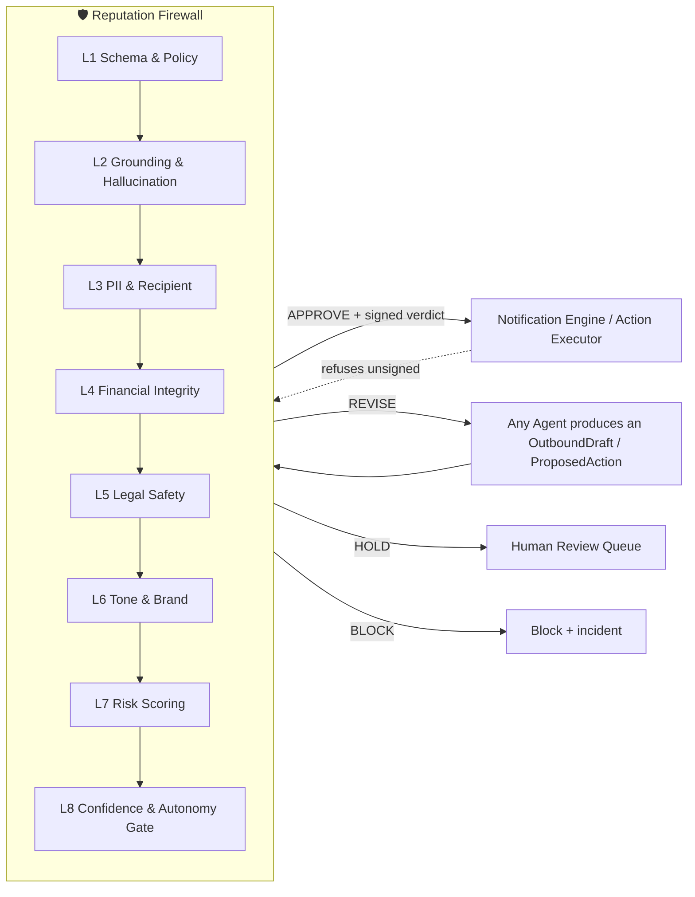
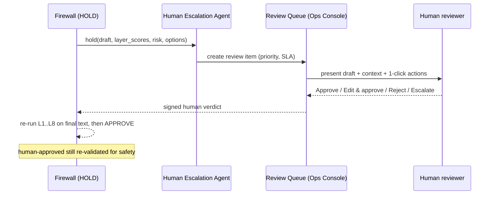

# 07 — Reputation Firewall & Risk Control Framework

> **This is the #1 requirement of CondominioOS.**
> **No outbound communication, financial action, or legal statement leaves the platform without
> passing through the Reputation Firewall.** It is a *mandatory, non-bypassable* gate, enforced
> architecturally (the Notification Engine refuses any artifact lacking a valid, signed firewall
> verdict).

Reference implementation: `services/condominioos/firewall/`.

---

## 1. Position in the architecture



Verdicts: **APPROVE**, **REVISE** (auto-fix & re-run), **HOLD** (human review), **BLOCK** (hard stop +
incident). Every verdict is signed and written to the audit log with all layer scores.

## 2. The eight guard layers

| # | Layer | Checks | Fail action |
|---|---|---|---|
| **L1** | **Schema & Policy** | Valid artifact schema; channel allowed; consent present; rate/cooldown limits; tenant context valid. | BLOCK |
| **L2** | **Grounding & Hallucination** | Every factual claim is supported by retrieved citations; claims w/o source flagged; numbers cross-checked vs source; "no fabricated facts". | REVISE→HOLD |
| **L3** | **PII & Recipient** | Correct recipient (owner vs tenant; right unit); no other unit's PII; minimization; no sensitive data over insecure channel. | BLOCK (wrong recipient) |
| **L4** | **Financial Integrity** | Amounts reconcile to ledger; no over-collection; correct payee/IBAN; math checks; duplicate-action guard. | BLOCK |
| **L5** | **Legal Safety** | No legal advice; no unfounded legal threats; required legal content present (e.g., convocation); regulation citations valid. | HOLD |
| **L6** | **Tone & Brand** | Professional, empathetic, on-brand IT register; no harassment cadence; reading level; banned-phrase list. | REVISE |
| **L7** | **Risk Scoring** | Risk Agent composite score (legal/financial/reputational/operational) + novelty. | raise tier |
| **L8** | **Confidence & Autonomy Gate** | Map (risk class × confidence) → A3/A2/A1/A0; route accordingly. | route |

A draft must **pass all layers** to be APPROVED. Any BLOCK is terminal (incident). REVISE allows up to
N auto-revision loops (default 2) before falling through to HOLD.

## 3. Confidence scoring

Composite confidence ∈ [0,1] per artifact:

```
confidence = w_g·grounding + w_m·model_self_consistency + w_r·retrieval_coverage
           + w_h·historical_success(intent) − penalties(novelty, ambiguity)
```

- **Grounding:** fraction of claims with valid citations (L2).
- **Model self-consistency:** agreement across sampled generations / verifier model.
- **Retrieval coverage:** did Knowledge Agent cover the query (vs `knowledge.miss`)?
- **Historical success:** calibrated success rate for this intent/agent.
- Calibrated against human outcomes by the QA Agent; thresholds are policy-as-code (§5).

## 4. Hallucination prevention (specifics)

1. **Grounded-only generation:** agents answer from retrieved context with inline citations; the
   prompt forbids unsupported claims and instructs "say you don't know / will check".
2. **Claim extraction + verification:** L2 extracts factual claims and checks each against cited
   sources (NLI-style verifier); unverifiable claims are stripped or the draft is held.
3. **Number/date guards:** all amounts, dates, deadlines, quorum figures are recomputed from
   structured data, not trusted from free text.
4. **Refusal path:** low coverage/confidence → the agent does not improvise; it asks a clarifying
   question or escalates.
5. **No-legal-advice policy:** legal interpretation is always routed to the AoR (L5 + A0).

## 5. Autonomy gate as policy-as-code

Risk class × confidence → autonomy tier (see doc 01 §4). Encoded declaratively, versioned, and
testable:

```yaml
# firewall/policies/autonomy.yaml  (illustrative)
risk_classes:
  legal_statement:      {min_tier: A0}          # always human
  collections_T2_T3:    {min_tier: A0}
  collections_T1:       {auto_if: {risk<=low, confidence>=0.9}, else: A1}
  financial_post:       {auto_if: {anomaly==false, confidence>=0.85}, else: A1}
  faq_grounded:         {auto_if: {grounded==true, confidence>=0.8}, else: A1}
  vendor_dispatch:      {auto_if: {compliant==true, cost<=threshold, confidence>=0.85}, else: A1}
  emergency_safety:     {min_tier: A0, notify: immediate}
thresholds:
  revise_max_loops: 2
  cooldown_between_reminders_days: 14
```

Changes to this policy are reviewed by the Risk & Compliance Board and gated by QA regression tests.

## 6. Communication review pipeline (HOLD path)



Reviewers get: the draft, the grounding/citations, recipient, risk rationale, and one-click
**Approve / Edit / Reject**. The human decision is recorded and fed back to QA/Risk as a learning signal.

## 7. Risk control framework (the four risk domains)

### 7.1 Legal risk controls
- No-legal-advice policy; legal interpretation → AoR (A0).
- Assembly legal validators (convocation content/notice, quorum, proxy limits).
- Regulation citations verified against the legal corpus (no invented articles).
- Document signing for legally-binding artifacts (minutes).

### 7.2 Financial risk controls
- **Reconciliation gate** before any collection action (no message without confirmed balance).
- Amount/IBAN/payee verification; duplicate-action guard; payment-matching confidence.
- Per-tenant financial action limits; large amounts → human.
- Segregation: agents propose, humans approve money-movement-adjacent actions.

### 7.3 Vendor risk controls
- Compliance gate (DURC, RC insurance, certifications) before dispatch — non-compliant = blocked.
- Cost thresholds → human approval; anti-collusion checks on quotes; performance scoring.

### 7.4 Reputational risk controls
- All 8 firewall layers; tone/brand guard; harassment-cadence limits.
- Per-tenant **autonomy ramp** (start supervised); kill-switch; wrongful-communication runbook.
- Continuous QA evals on the four "moments of truth" (doc 02).

### 7.5 GDPR controls
- Recipient/PII guard (L3); minimization in prompts; consent checks (L1).
- DSAR/erasure tooling; EU residency; no-train LLM config; processing register & DPIA.
- Right to human review of automated decisions (enforced by tiers).

## 8. Non-bypassability (how it's enforced, not just promised)

1. The **Notification Engine and Action Executor accept only artifacts with a valid, signed,
   unexpired firewall verdict** referencing the exact artifact hash. No verdict ⇒ refusal.
2. Agents have **no channel-sending tool** at all; the only egress is via the gated executor.
3. A continuous **firewall-coverage audit** asserts: `count(outbound) == count(approved_verdicts)`;
   any drift is a sev-1 incident.
4. The firewall itself is covered by a regression eval suite that must pass before any deploy.

## 9. Evaluation & continuous assurance

- **Red-team suite:** prompt-injection, jailbreaks, wrong-recipient traps, over-collection traps,
  fabricated-legal-claim traps — run pre-deploy and on schedule.
- **Golden sets** for the four moments of truth; LLM-as-judge calibrated to human labels.
- **Production sampling:** QA Agent samples approved outputs for post-hoc scoring; regressions roll
  autonomy back automatically.
- **Metrics (firewall):** block/hold/revise/approve mix, wrong-recipient (→0), over-collection (→0),
  ungrounded-approved (→0), human-review SLA, auto-revision success rate.

## 10. Summary

The Reputation Firewall converts "trust us, the AI is careful" into an **enforced, auditable,
testable control plane**. It is the difference between a demo and a service a stranger lets near
their building's money and legal obligations.
