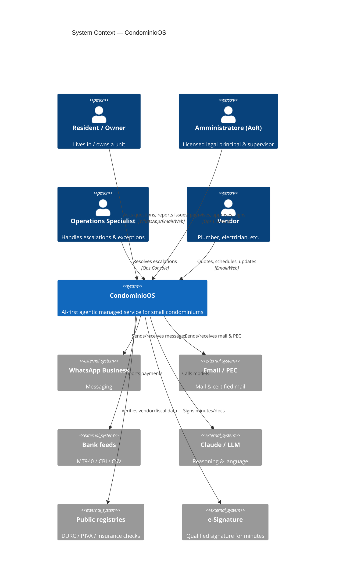
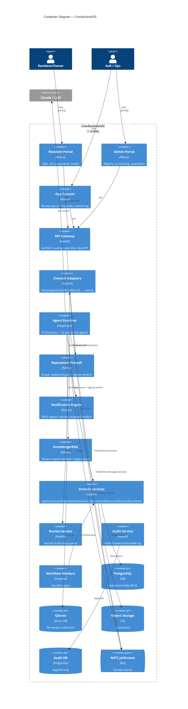
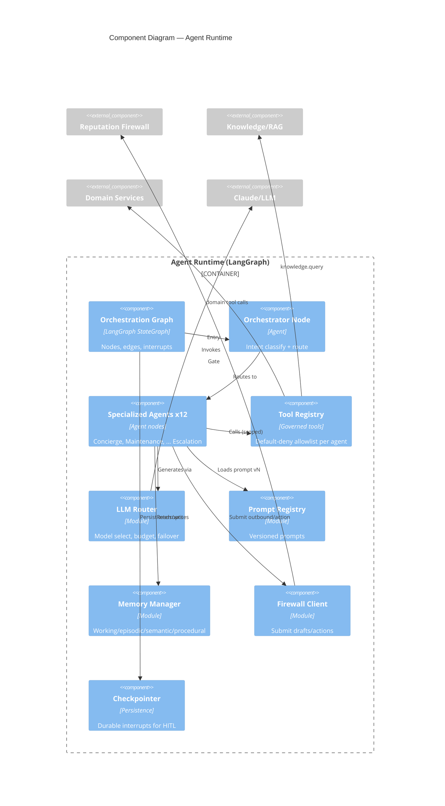

# 10 — C4 Architecture Diagrams (Mermaid)

C4 model levels 1–3 for CondominioOS. (Level 4/code is the repo itself + docs 13/15.)

---

## Level 1 — System Context



## Level 2 — Containers



## Level 3 — Component: Agent Runtime



## Level 3 — Component: Reputation Firewall

```mermaid
C4Component
  title Component Diagram — Reputation Firewall
  Container_Boundary(fw, "Reputation Firewall") {
    Component(pipe, "Guard Pipeline", "Orchestrates L1..L8")
    Component(l1, "L1 Schema & Policy")
    Component(l2, "L2 Grounding/Hallucination")
    Component(l3, "L3 PII & Recipient")
    Component(l4, "L4 Financial Integrity")
    Component(l5, "L5 Legal Safety")
    Component(l6, "L6 Tone & Brand")
    Component(l7, "L7 Risk Scoring")
    Component(l8, "L8 Confidence & Autonomy Gate")
    Component(verdict, "Verdict Signer", "Signs APPROVE/HOLD/BLOCK/REVISE")
    Component(policy, "Policy Store", "autonomy.yaml, banned-phrases, limits")
  }
  Component_Ext(risk, "Risk Agent")
  Component_Ext(kn, "Knowledge (citations)")
  Component_Ext(ledger, "Accounting (reconcile)")
  Component_Ext(review, "Review Service")
  Component_Ext(notif, "Notification Engine")
  Component_Ext(audit, "Audit Service")

  Rel(pipe, l1, ""); Rel(l1, l2, ""); Rel(l2, l3, ""); Rel(l3, l4, "")
  Rel(l4, l5, ""); Rel(l5, l6, ""); Rel(l6, l7, ""); Rel(l7, l8, "")
  Rel(l2, kn, "Verify citations")
  Rel(l4, ledger, "Reconcile amounts")
  Rel(l7, risk, "Composite score")
  Rel(l8, verdict, "Tier → verdict")
  Rel(pipe, policy, "Reads policy")
  Rel(verdict, notif, "APPROVE")
  Rel(verdict, review, "HOLD")
  Rel(pipe, audit, "Logs all layer scores")
```
