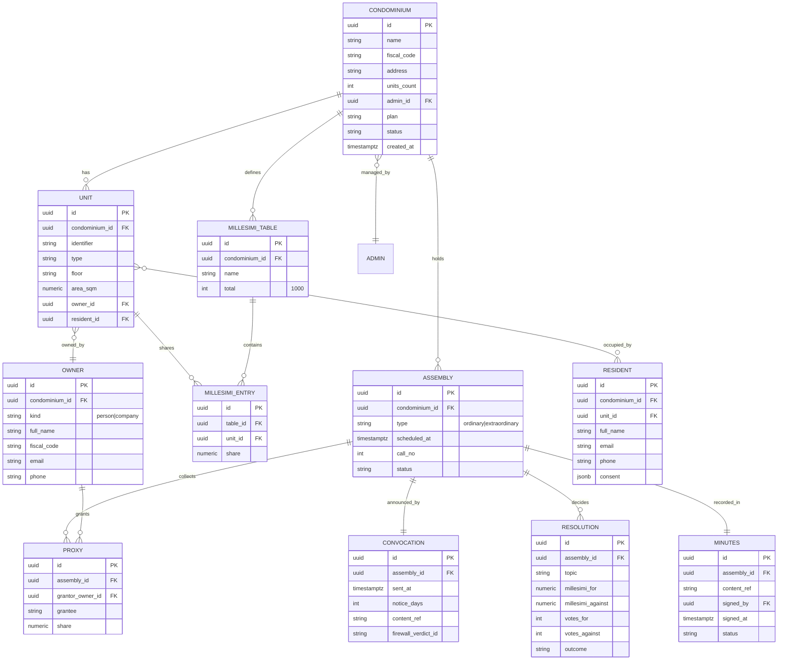
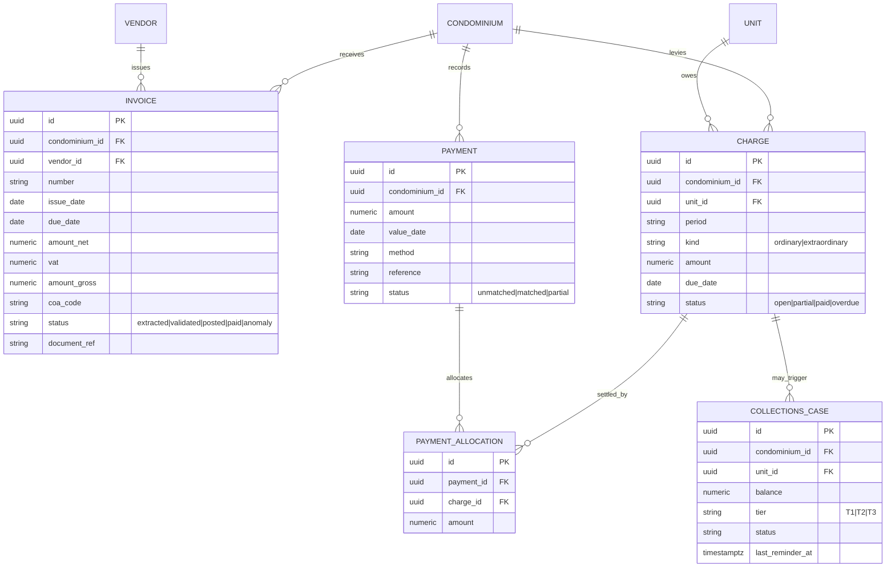
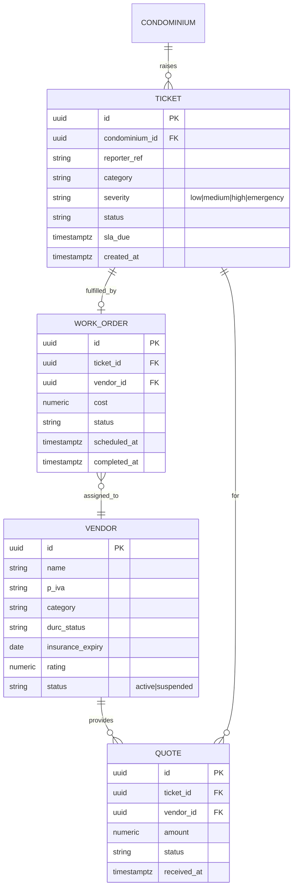
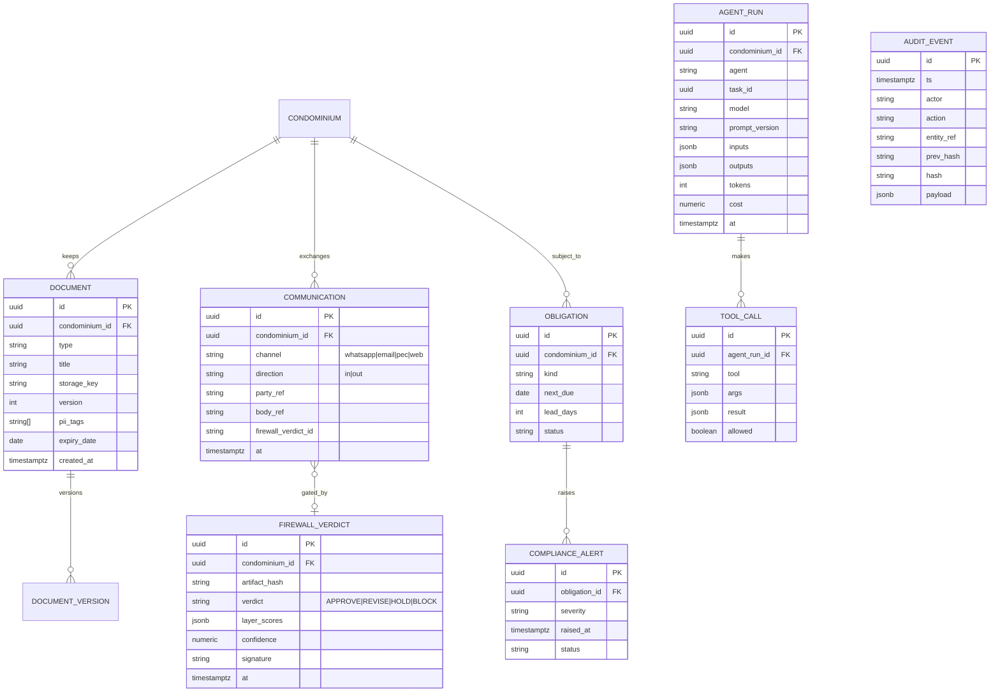

# 12 — Data Model Diagrams

ER diagrams (Mermaid). Canonical DDL: `services/condominioos/db/schema.sql`. ORM:
`services/condominioos/db/models.py`. All tenant tables carry `condominium_id` with RLS (doc 05).

---

## 1. Core registry & governance

## 2. Financial

## 3. Maintenance & vendors

## 4. Documents, communications, compliance, audit, agents

