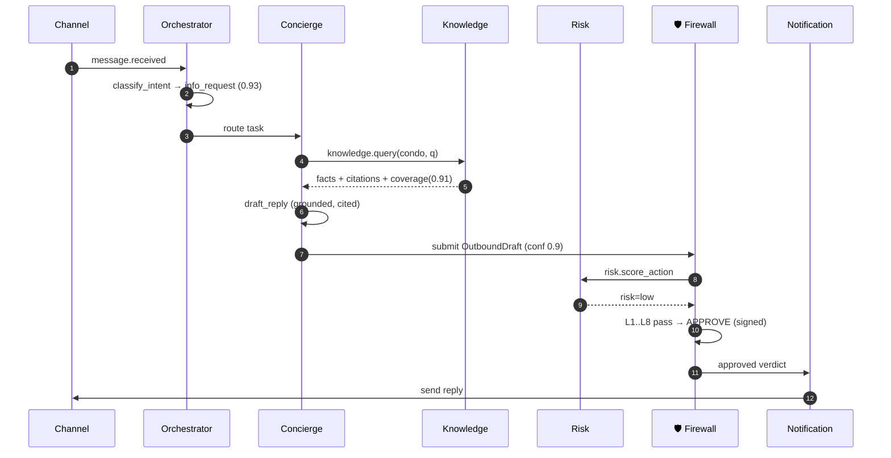
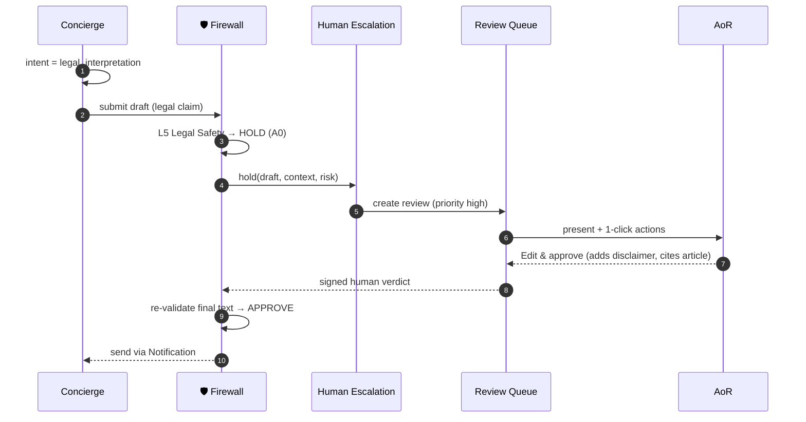
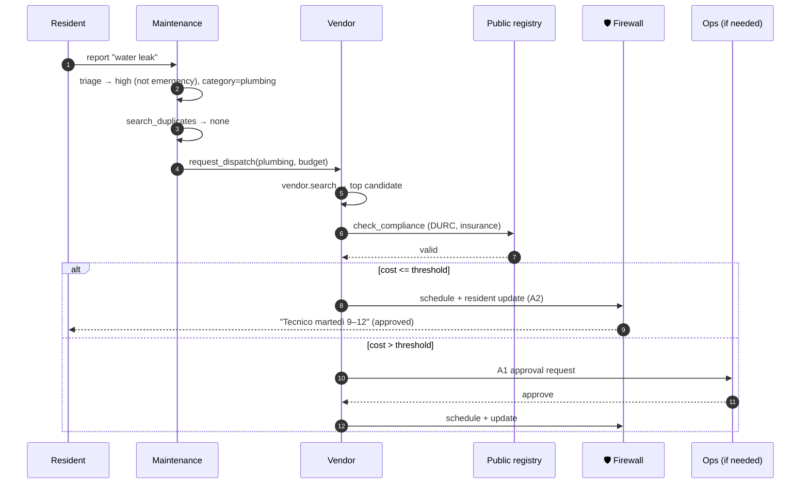
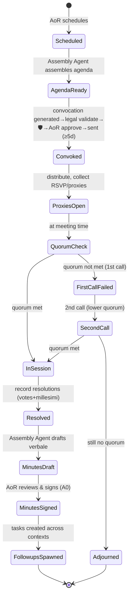
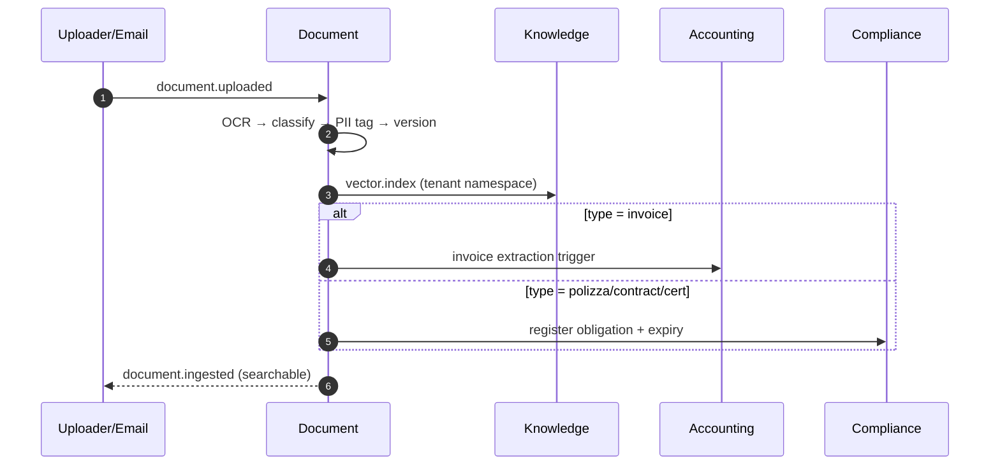
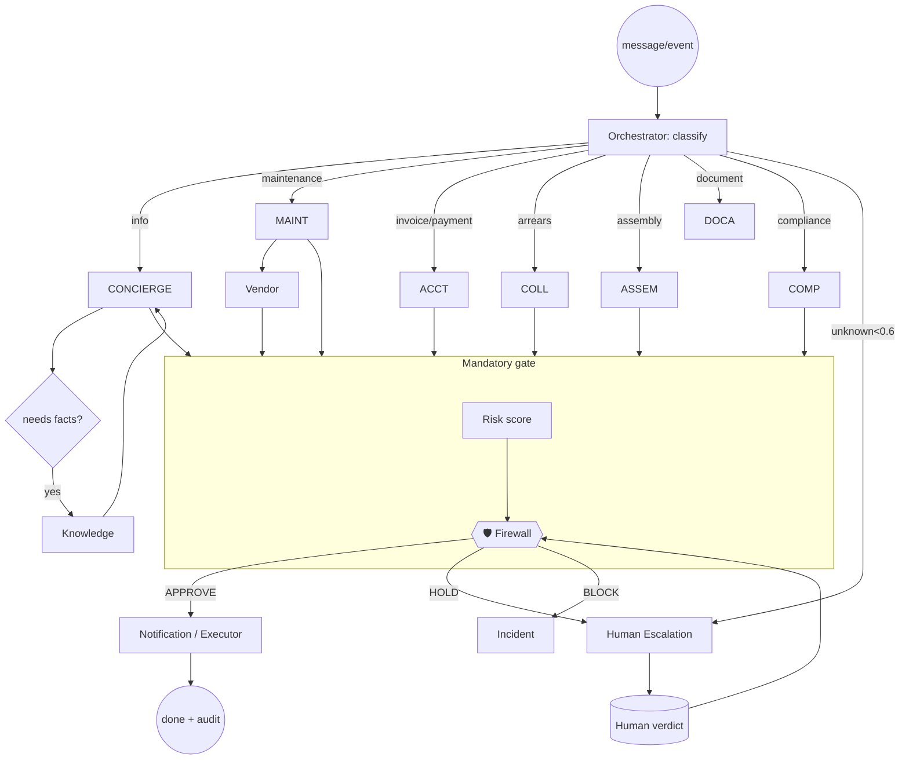

# 13 — Agent Interaction Diagrams

Sequence & state diagrams for the key agent flows. Firewall (🛡️) and Audit are implicit on every
outbound/financial/legal action.

---

## 1. Resident question (grounded FAQ, fully automated)



## 2. Concierge → human escalation (legal intent)



## 3. Maintenance dispatch (with compliance + cost gate)



## 4. Collections (reconciliation gate — the careful flow)

```mermaid
sequenceDiagram
  autonumber
  participant L as Accounting/Ledger
  participant CO as Collections
  participant REC as Reconciliation
  participant F as 🛡️ Firewall
  participant N as Notification
  L->>CO: charge.overdue_detected(unit, amount)
  CO->>REC: confirm reconciliation (balance match?)
  alt mismatch
    REC-->>CO: MISMATCH
    CO->>F: (blocked) → Ops investigation
    Note over CO,F: NO reminder is ever sent on mismatch
  else confirmed
    REC-->>CO: arrears.confirmed(exact balance, debtor=owner)
    CO->>CO: tier = T1 (first, soft), cooldown ok
    CO->>F: draft reminder (amount, recipient)
    F->>F: L3 recipient + L4 financial + L6 tone
    F-->>N: APPROVE (A2, T1)
    N-->>L: reminder sent; case tracked
  end
```

## 5. Assembly lifecycle (state machine)



## 6. Document ingestion → multi-agent fan-out



## 7. Orchestration graph (LangGraph topology)


